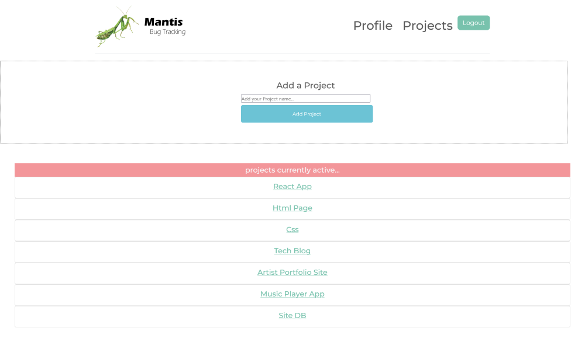

# Bug-Tracker

MERN Apollo Server/Client Bug Tracking Application using a Mongo database

[Repo Url](https://github.com/MasonMarc/Bug-Tracker)

# Table of Contents

[Descriptions](#descriptions)

[Resources](#resources)

[Visuals](#visuals)

# Descriptions 

MERN stack bug tracking app that allows users to add projects, and add/delete bugs to projects in a mongo database

# Visuals

# Resources

[react](https://reactjs.org/)

[MongoDB](https://www.mongodb.com/)

[bootstrap](https://getbootstrap.com)
